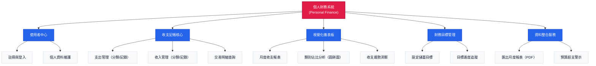

# 💰 Personal Finance System

一個「直接能用」的個人財務管理系統。前端用 Vue 3 + TypeScript，後端用 Django 6 + REST Framework，已附好 Docker 讓你一鍵啟動。

- **想試跑**：只要裝好 Docker，一行指令即可啟動（不需要安裝 Python、Node.js）
- **想開發**：前後端程式碼都在專案內，改完重建容器即可
---

## ✨ 核心功能

### 記帳管理
- 🏷️ 收入 / 支出記錄，支援自訂類別（最多 50 類）
- 📊 即時圖表分析（圓餅圖），快速查看分類佔比
- 📋 交易清單（支援分頁、篩選、編輯、刪除）
- 🗓️ **月份篩選**：所有端點支援 `?month=YYYY-MM` 參數查詢歷史數據

### 報表與洞察
- 📈 月度財務報表（收入 / 支出 / 結餘）
- 💡 智能財務建議（基於消費模式自動生成）
- 🎯 目標追蹤（設定收入 / 支出目標，超支自動提醒）
- 📄 PDF 報表下載

### 安全與限制
- 🔐 密碼驗證（最少 6 字元，禁止常見密碼）
- 👤 使用者名稱驗證（僅允許字母數字底線減號）
- 📏 資料限制（每用戶最多 10,000 筆記錄、50 個類別）
- 💰 金額支持（最大 18 位數，精度 2 位小數）

---

## � 系統架構圖



---

## �🚀 2 分鐘快速啟動（Docker）

### 1. 下載專案
```bash
git clone https://github.com/littleMtd/final_project.git
cd frontend-backend
```

### 2. 複製環境設定檔
```bash
# Windows PowerShell
copy .env.dev.example .env.dev

# macOS / Linux
cp .env.dev.example .env.dev
```

### 3. 啟動容器
```bash
docker compose -f docker-compose.dev.yml up -d --build
```

### 4. 打開瀏覽器
- **前端頁面**：http://localhost （註冊後即可使用）
- **後端 API**：http://localhost:8000

### 5. 停止容器
```bash
docker compose -f docker-compose.dev.yml down
```

---

## 🛠️ 本地開發（不使用 Docker）

### 後端（Django）
```bash
cd backend
python -m venv .venv

# Windows
.venv\Scripts\Activate.ps1

# macOS/Linux
source .venv/bin/activate

pip install -r requirements.txt
python manage.py migrate
python manage.py runserver
```

### 前端（Vue + Vite）
```bash
cd frontend
npm install
npm run dev
```

前端開發伺服器預設在 `http://localhost:5173`，後端 API 在 `http://localhost:8000`。

---

## 📁 專案結構

```
frontend-backend/
├── backend/                      # Django 6 後端
│   ├── myapp/                    # 主應用程式
│   │   ├── models.py            # 資料模型（User, Income, Expense, Goal）
│   │   ├── serializers.py       # DRF 序列化器
│   │   ├── services.py          # 業務邏輯層
│   │   └── views/               # API 端點
│   ├── settings.py              # Django 設定
│   ├── requirements.txt         # Python 依賴
│   └── Dockerfile               # 後端容器建置
├── frontend/                     # Vue 3 + TypeScript 前端
│   ├── src/
│   │   ├── components/          # UI 組件
│   │   ├── composables/         # 組合式函數
│   │   ├── views/               # 頁面視圖
│   │   └── api/                 # API 請求層
│   ├── package.json
│   └── Dockerfile               # 前端容器建置
├── docker-compose.dev.yml        # 開發環境編排
├── docker-compose.prod.cf.yml    # 生產環境（Cloudflare）
├── docker-compose.prod.direct.yml# 生產環境（直接對外）
└── .env.dev.example             # 環境變數範本
```

---

## 🔌 API 端點概覽

### 認證
- `POST /api/session/signup/` - 註冊
- `POST /api/session/login/` - 登入
- `POST /api/session/logout/` - 登出
- `GET /api/session/user/` - 取得當前使用者

### 收支管理
- `GET /api/expense/types/` - 取得支出類別
- `POST /api/expense/types/` - 新增支出類別
- `POST /api/expense/entry/` - 新增支出記錄
- `PATCH /api/expense/entry/<id>/` - 更新支出記錄
- `DELETE /api/expense/entry/<id>/` - 刪除支出記錄
- `GET /api/expense/total/?month=YYYY-MM` - 取得總支出（支援月份篩選）
- `GET /api/expense/type/<name>/?month=YYYY-MM` - 取得特定類別支出

*（收入端點 `/api/income/...` 結構相同）*

### 清單與報表
- `GET /api/ledger/?kind=all&month=YYYY-MM&page=1` - 取得交易清單（支援月份篩選、分頁）
- `GET /api/report/?month=YYYY-MM` - 取得月度報表
- `DELETE /api/report/?month=YYYY-MM` - 刪除特定月份報表
- `GET /api/insights/?month=YYYY-MM` - 取得財務建議
- `DELETE /api/insights/?month=YYYY-MM` - 刪除特定月份數據

### 目標管理
- `GET /api/purpose/?month=YYYY-MM` - 取得財務目標
- `POST /api/purpose/` - 新增 / 更新目標

---

##  常見問題

**Q: 我需要安裝 Python 或 Node.js 嗎？**  
A: 不用。Docker 會處理所有環境，本機完全不需要安裝開發工具。

**Q: 我要用自己的資料庫嗎？**  
A: 不需要。預設使用 SQLite（已足夠）。若要換 PostgreSQL 可編輯 `.env.dev` 的 `DATABASE_URL`。

**Q: Docker 啟動失敗怎麼辦？**  
A: 確認 Docker Desktop 已啟動並執行中，然後重試 `docker compose -f docker-compose.dev.yml up --build`。

**Q: 想自訂 SECRET_KEY 怎麼辦？**  
A: 編輯 `.env.dev`，將 `SECRET_KEY=` 後面換成任何長隨機字串（開發環境可用預設值）。

**Q: 如何查看歷史月份數據？**  
A: 所有查詢端點都支援 `?month=YYYY-MM` 參數，例如：`/api/report/?month=2024-03`。

**Q: 為什麼我的資料新增失敗？**  
A: 檢查是否達到限制（10,000 筆記錄或 50 個類別），或金額超過上限（18 位數）。

---

## 📝 開發紀錄

### 最新更新
- ✅ 所有查詢端點支援月份參數（`?month=YYYY-MM`）
- ✅ UI/UX 全面優化（淺色主題、焦點可見、一致性提升）
- ✅ 新增三張資訊卡片（收入 / 支出 / 餘額）取代舊版 SummaryBar
- ✅ 增強安全性（密碼驗證、使用者名稱格式、檔案權限）
- ✅ 資料限制（10k 筆記錄、50 類別、金額上限）
- ✅ DELETE 端點支援刪除特定月份報表與數據

---

## 📄 授權

This project is licensed under the MIT License - see the [LICENSE](LICENSE) file for details.
